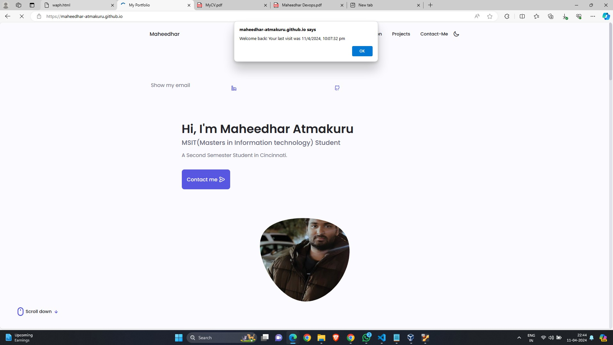
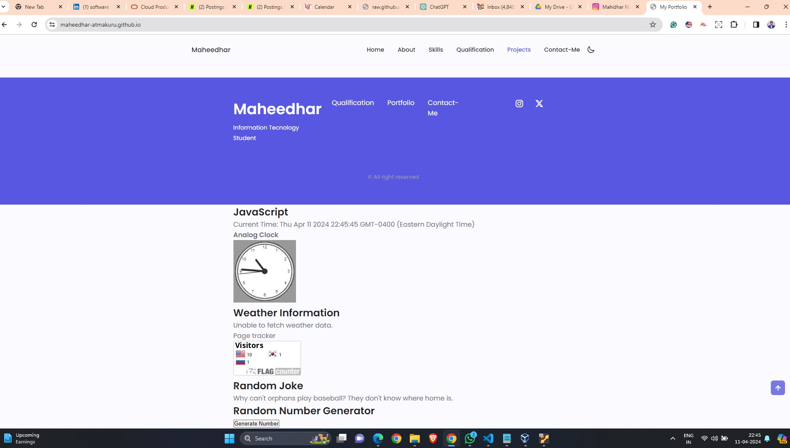

# WAPH - Web Application Programming and Hacking

## Instructor: Dr. Phu Phung

## Student name: Maheedhar Atmakuru

## Student mail: bodapatmakumaass@mail.uc.edu

{width=150px height=150px}

# Individual Project 1 - Front-end Web Development 

## Overview and Requirements 

I began with a simple HTML file that displayed my photo, name, and additional details. Subsequently, I incorporated elements from Lab2 into this project, including features for email, analog and digital clocks, and viewing GIFs through JavaScript code. I also integrated APIs like JokeAPI and Weatherbit into my index.html file. Moreover, I implemented cookies in my index.html using JavaScript. This project encompassed a range of topics including HTML, CSS, JavaScript, Ajax, and jQuery, and involved using APIs to fetch data.

I have uploaded the code in my private repository [https://github.com/sohanchidvilasbodapati.github.io] (https://github.com/sohanchidvilasbodapati.github.io)

### Task 1: github.io website creation

For this project, I created a GitHub repository named github.io, following the naming guidelines specified by the lecturer. I then made this repository public. After that, I cloned the repository to my local workspace and created a file named waph.html based on the sixth video lecture. Subsequently, I developed an index.html file that includes a headshot and some basic HTML headings. Additionally, I incorporated the code from my Lab 2 into the index.html file.

#### a.Creation and cloning:
Following my professor's recommendation, I started by setting up a GitHub repository using a specific naming convention essential for GitHub Pages to recognize my site as personal. This initial step is crucial for hosting my site on GitHub. I then made this repository publicly accessible, a necessary move to allow public viewing of my site, aligning with GitHub Pages' purpose of showcasing and sharing projects.

I expanded my website's content by adding a new HTML file named "waph.html," as directed in video class number 6. This file could potentially incorporate more features, enhancing the website's dynamics by using separate HTML files for different functions.

####  b. Bootstrap files

My professor recommended using Bootstrap for this assignment, so I looked up free Bootstrap themes online, chose one, and customized it to meet my needs. Additionally, I downloaded Bootstrap from its official website and integrated it into my HTML file. I included my resume in PDF format on the website, organizing it across various divs and subpages. Furthermore, I utilized CSS to incorporate forms within divs and display images in frames.

#### c. Javascript files

I have incorporated various functionalities such as digital and analog clocks, along with email features, continuing from lab 2. Additionally, I have integrated the JokesAPI and Weatherbit API into the index.html file using the concept of APIs. The JokesAPI randomly displays a joke every minute, while the Weatherbit API provides local weather updates. The Weatherbit API is public, but each user needs to generate a unique API key for use, which must be integrated into their code. Unlike the Weatherbit API, the JokesAPI does not require an API key and simply presents a random joke. Moreover, I have embedded a free flag counter on the index.html, which adds a new country flag.

The main purpose of the website's cookie management is to inform users that they have previously visited the page at a certain time. Initially, the website displays a welcome message when a user visits for the first time. On subsequent visits, it shows a "welcome back" message along with the timestamp of their last visit. To enhance user experience, the cookies are set to expire after 30 days.

Additionally, I have integrated a random luck generator using JavaScript that produces a random lucky number. From Lab 2, I also incorporated significant code for both the digital and analog clocks.

